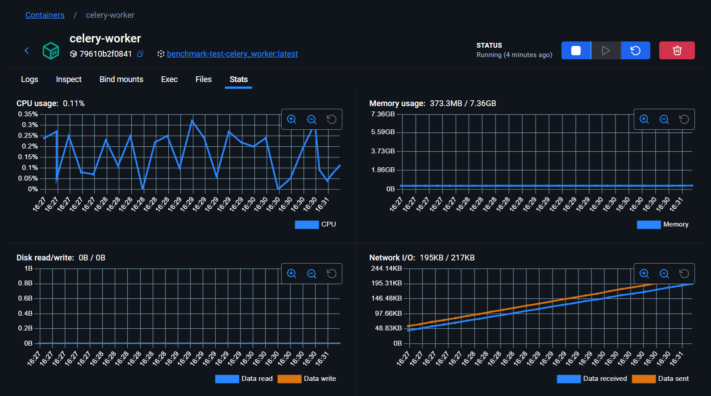

# Benchmark Tasks

## Описание

Этот проект предназначен для сравнения производительности различных систем очередей задач: **Celery**, **Huey** и **Taskiq**. В директории `src/app` реализованы задачи для каждой из систем, а в `src/benchmark` находятся тесты для их бенчмаркинга.

## Структура проекта

- `src/app/celery_tasks.py` — задачи для Celery
- `src/app/huey_tasks.py` — задачи для Huey
- `src/app/taskiq_tasks.py` — задачи для Taskiq
- `src/app/main.py` — основной модуль приложения
- `src/benchmark/test_tasks.py` — тесты и бенчмаркинг задач

## Требования

- Python 3.11+
- pip
- Docker и Docker Compose (для контейнеризации)

## Установка

1. Клонируйте репозиторий:
   ```
   git clone <repo_url>
   cd <repo_dir>
   ```
2. Установите зависимости:
   ```
   pip install -r requirements.txt
   ```

## Запуск с помощью Docker Compose

1. Убедитесь, что установлены Docker и Docker Compose.
2. Запустите сервисы:
   ```
   docker compose up --build
   ```
3. Для остановки сервисов:
   ```
   docker compose down
   ```

## Запуск тестов

Перейдите в директорию `src` и выполните:
```
pytest
```

## Контакты

Автор: Jahongir Hakimjonov  
Email: jahongirhakimjonov@gmail.com

## Результаты бенчмаркинга

### Celery
Начало работы: 2025-07-10 16:27:02
Завершение работы: 2025-07-10 16:27:06
Затраты на выполнение: 4 секунды


### Huey
Начало работы: 2025-07-10 16:27:01
Завершение работы: 2025-07-10 16:30:31
Затраты на выполнение: 3 минуты 30 секунд


### Taskiq
Начало работы: 2025-07-10 16:27:02
Завершение работы: 2025-07-10 16:27:21
Затраты на выполнение: 19 секунд


### Сравнение производительности


---

Этот README.md содержит информацию о назначении, структуре, установке и запуске проекта, а также инструкции по использованию Docker Compose.